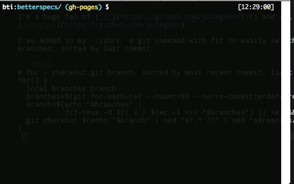

# Quick git branch switcher with FZF

I'm a huge fan of [fzf](https://github.com/junegunn/fzf) and all the work of
[Junegunn](https://github.com/junegunn).🎈🎈🎈

I've added in my `.zshrc` a git command with fzf to easily switch to last 30
branches, sorted by last commit.

```shell
# fbr - checkout git branch, sorted by most recent commit, limit 30 occurences
fbr() {
  local branches branch
  branches=$(git for-each-ref --count=30 --sort=-committerdate refs/heads/ --format="%(refname:short)") &&
  branch=$(echo "$branches" |
           fzf-tmux -d $(( 2 + $(wc -l <<< "$branches") )) +m) &&
  git checkout $(echo "$branch" | sed "s/.* //" | sed "s#remotes/[^/]*/##")
}
```

Demo :


