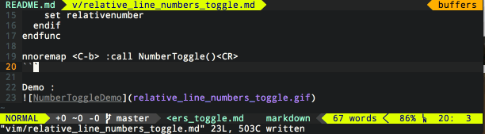

#Relative line numbers toggle

Sometimes in Vim I'm using line numbers toggle. I some people like r00k use it
all the time. But for the moment I didn't switch completly.

I have in my `.vimrc` a quick toggle with Ctrl+b

```viml
" relativenumber line number
function! NumberToggle()
  if(&relativenumber == 1)
    set norelativenumber
    set number
  else
    set relativenumber
  endif
endfunc

nnoremap <C-b> :call NumberToggle()<CR>
```

Demo :


