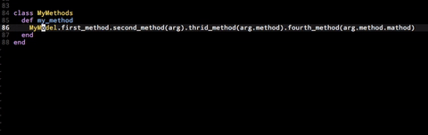

# Split lines with dots

I'm writing a lot of ruby and sometimes I end with very long lines that I want to split quickly.

For example

```ruby
class MyMethods
  def my_method
    MyModel.first_method.second_method(arg).thrid_method(arg.method).fourth_method(arg.method.mathod)
  end
end
```

I've map to `leader` + `s` a command to split at dots. It also auto indent new lines.

```vim
" Split long lines with dots
map <Leader>s :s/^  // <Bar> s/\v\ze%(\(\w+%(\.\w+)*)@<!\./\="\n " . matchstr(getline('.'), '^\s*')/g<CR>
```

It's not that fast but it's work.

## Demo



## Credits

Huge thanks to this anonymous user how help me to do this
http://vi.stackexchange.com/questions/7732/efficient-ruby-line-spliting
